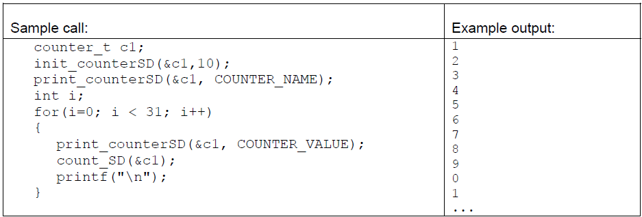
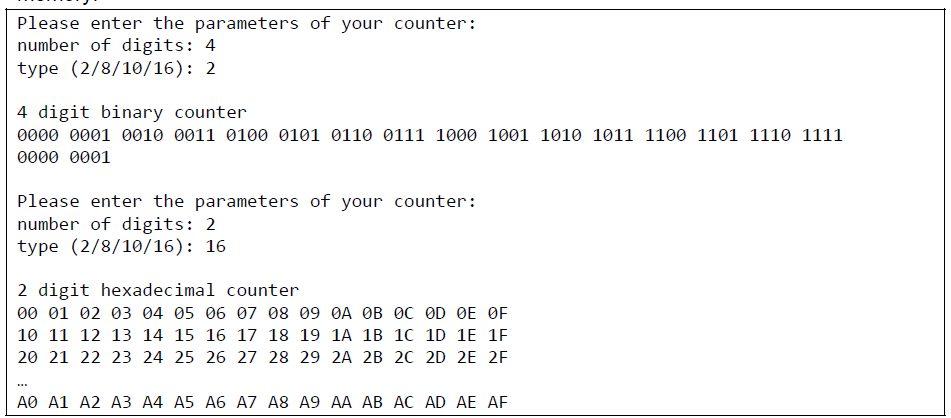
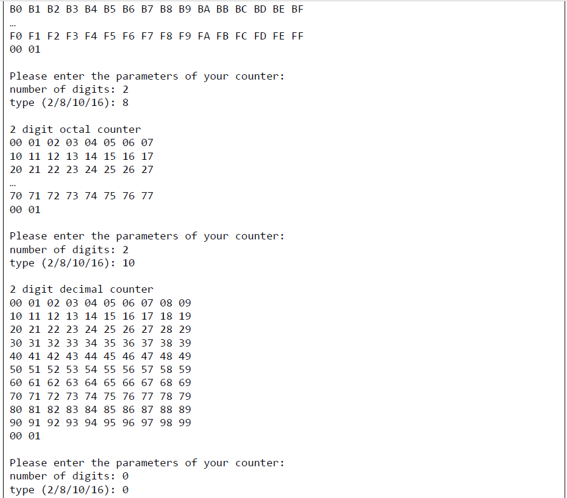

# ModuloNCounter #

## Exercise 1 - Modulo n counter ##
Write a small program which uses a data structure to store the properties of a modulo n counter, which counts from 0 to n-1, just beginning at 0 again after having reached n-1 (overflow).

Declare a data structure for counters with integer members for:
-   the maximum count value (n)
-   the current count value

Define a new Type for the data structure using typedef.

Write functions which
-   initializes a counter by setting the current count value to 0 and the maximum count value to an arbitrary value.
-   counts, that is increase the current count value of a passed counter by 1 or reset it to 0, in case of the value becomes greater than n-1 (overflow). It returns 1 if an overflow had occurred otherwise 0.
-   optionally prints the name of the counter (modulo n counter, n should be replaced by the current value of the maximum count value) or the current count value (without newline!).

Use an enumeration type to pass the option.

Test the code with a modulo 10 counter, print its name, count three times until the overflow while printing the actual count value after each counting step.

## Exercise 2 - Multiple digit counter ###

The program of exercise 1 has to be expanded in order to handle not only counters with one digit but with m digits. For that, declare a new structure for a multiple digit counter, consisting of:
-   a pointer for the address of an array of modulo n counters;

-   the number of digits m (which is equal to the number of modulo n counters in the array).

Write additional functions which
-   initializes a multiple digit counter by creating an array of m counters and storing the number of digits into the structure member. Additionally the function initializes the counters of the array by setting their current count values to 0 and their maximum count value to one of the following values – 2 (binary), 8 (octal), 10 (decimal) or 16 (hexadecimal). The function returns 0 in case the maximum count value is not allowed or the number of digits is 0, otherwise 1.
    Hints: You have to pass the address of a multiple digit structure variable. Why?
    You have to allocate dynamic memory! Why?
    Of course, each counter of the array must have the same maximum count value.

-   increases the actual count value of a multiple digit counter by 1 or resets it to 0 in case of an overflow.

-   optionally prints the name of the counter (m digit binary/octal/decimal/hexadecimal counter, m and the type should be replaced by the current values) or the current count value of the m digit counter (with one space after the digits!). Use the enumeration type to pass the option.
    Note: Try to format the output into 8 columns if n equals to 8, 10 columns if n equals to 10 and 16 columns if n equals to 2 or 16.
    Consider, that hexadecimal digits have values between 0 and 9 and 'A' and 'F'.

-   de-initializes a multiple digit counter by releasing the memory of its array of counters and setting its members to NULL and 0 respectively.

Whenever it makes sense, call the functions of the modulo n counters from exercise 1. Test the code. The user enters the number of digits (m) and the maximum count value of the counter (n). The program, creates and initializes a multiple digit counter, prints its name and counts until the overflow occurs while printing the current count value after each counting step. If the user enters an invalid maximum count value, the program stops. Don't forget to release the memory!

## Exercise 3 - Object oriented Modulo N Counter

Develop a object oriented version by building upon the first two exercises.

Implement the classes ModuloNDigit and ModuloNCounter that provide the same functionality as the
structs and their associated functions from the Modulo Counter Document. 

Define constructors and destructors as substitutes of the functions with the corresponding purpose.

Additionally, provide the functionality to increment the values of instances of the two counter types by overloading the prefix and postfix increment operators, thus making it possible to write counter++ and ++counter (Observe the proper semantics of the two operators).

UML class diagrams and documentation.

